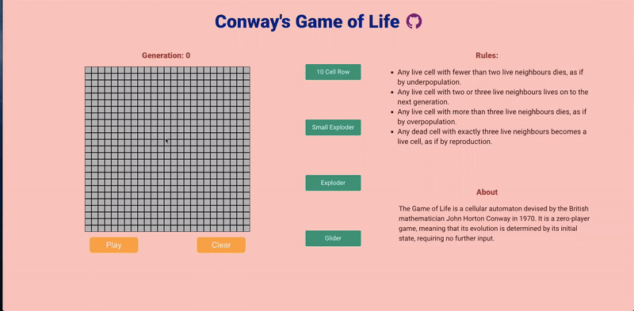

# [Conway-Game-of-Life](https://conway-game-of-life-iota.vercel.app/)

The Game of Life is a cellular automaton devised by the British mathematician John Horton Conway in 1970. It is a zero-player game, meaning that its evolution is determined by its initial state, requiring no further input.

## Rules

- Any live cell with fewer than two live neighbors dies, as if by underpopulated.
- Any live cell with two or three live neighbors lives on to the next generation.
- Any live cell with more than three live neighbors dies, as if by overpopulation.
- Any dead cell with exactly three live neighbors becomes a live cell, as if by reproduction.

## Instruction

- Create your own figure on the grid, or choose one from the sidebar
- Click "Play", you'll see the cells are running until they gone.
- Click "Stop" to stop the cells running.
- Click "Clear" to clear the whole cells.

## [Deploy](https://conway-game-of-life-iota.vercel.app/)

You can check my deployment [Here](https://conway-game-of-life-iota.vercel.app/).
(https://conway-game-of-life-iota.vercel.app/).
